# Procesverslag
Markdown is een simpele manier om HTML te schrijven.  
Markdown cheat cheet: [Hulp bij het schrijven van Markdown](https://github.com/adam-p/markdown-here/wiki/Markdown-Cheatsheet).

Nb. De standaardstructuur en de spartaanse opmaak van de README.md zijn helemaal prima. Het gaat om de inhoud van je procesverslag. Besteedt de tijd voor pracht en praal aan je website.

Nb. Door *open* toe te voegen aan een *details* element kun je deze standaard open zetten. Fijn om dat steeds voor de relevante stuk(ken) te doen.

## Jij

  
uitwerken voor kick-off werkgroep

  ### Auteur:
  Noah Baggerman

  #### Je startniveau:
  Blauwe piste

  #### Je focus:
  Responsive
 

## Je website

  
uitwerken voor kick-off werkgroep

  ### Je opdracht:
  https://www.vanharen.nl/nl-nl/

  #### Screenshot(s) van de eerste pagina (small screen): 
  hier de naam van de pagina  
  

  #### Screenshot(s) van de tweede pagina (small screen):
  hier de naam van de pagina  
  
 

## Toegankelijkheidstest 1/2 (week 1)

  
uitwerken na test in 2e werkgroep

  ### Bevindingen
  1. Bij het valideren van de HTML kwamen er zoveel foutmeldingen naar boven, dat het maximale
  aantal foutmeldingen behaald werd (1000 foutmeldingen).
  2.  De focus style is niet erg goed zichtbaar
  3. De buttons zijn allemaal erg groot, maar (bijna) alles is klikbaar en dit kan er wel voor
  zorgen dat je perongeluk op dingen klikt. Er is wel genoeg ruimte om dit over het algemeen te
  voorkomen.
  4. Er worden enorm veel divjes gebruikt. 
  5. Er zijn geen video's op de site en er is ook geen audio. Er zijn wel veel automatische
  caroussellen. Deze kan je niet uitzetten. 
  6. De website werkt niet met een donker thema. Het blijft altijd wit. 

## Breakdownschets (week 1)

  
uitwerken na afloop 3e werkgroep

  ### de hele pagina: 
  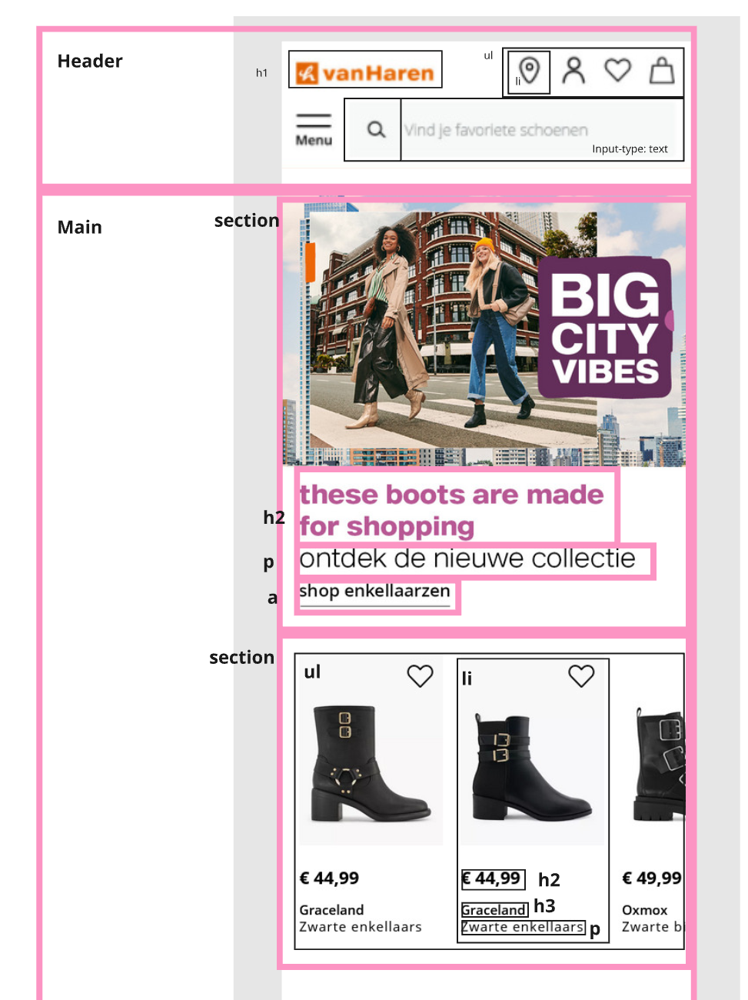

  ### dynamisch deel (bijv menu): 
  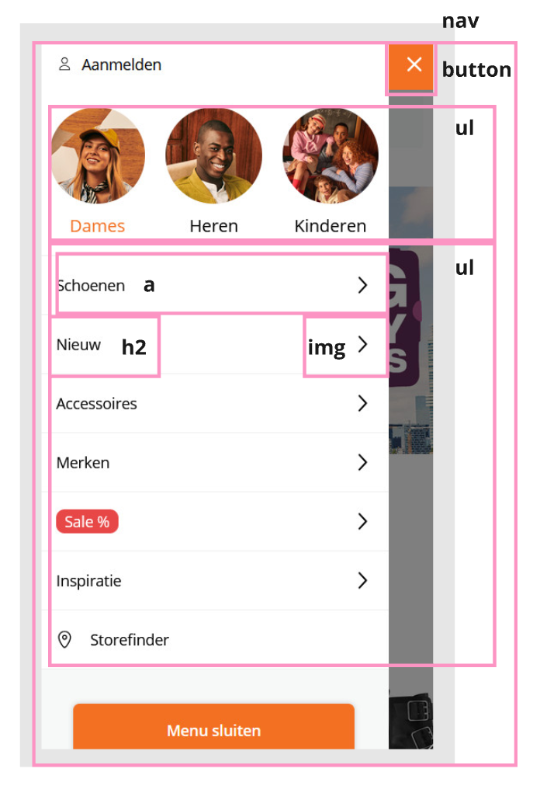

  ### pagina 2: 
  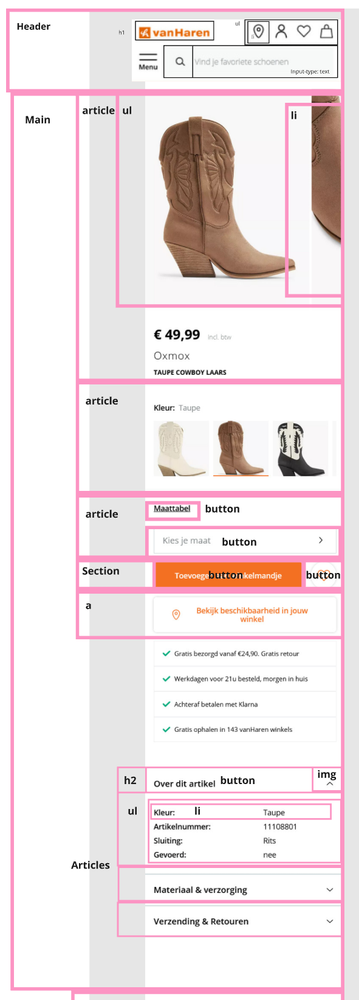

  ### link naar het mirobord
  https://miro.com/app/board/uXjVLdnZSKE=/

## Voortgang 1 (week 2)

  
uitwerken voor 1e voortgang

  ### Stand van zaken
  Ik had in deze week een deel van de HTML voor de eerste pagina
  gemaakt en een stukje CSS. Ik had ook Javascript voor de
  navigatie, maar deze werkte niet goed en ik heb dit uiteindelijk ook weggehaald.
  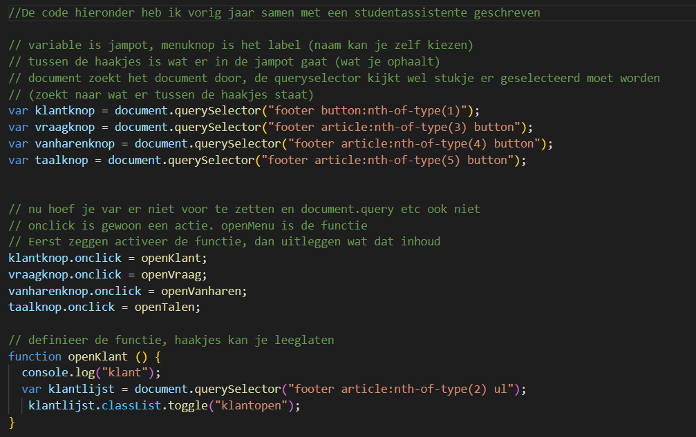
  Ik heb de code later wel hergebruikt voor de dropdown menus. Ik heb ook dezelfde notaties er nog bij staan.

  ### Agenda voor meeting
  samen met je groepje opstellen

  Noah: 
  1. Hoe zit het met de custom fonts
  2. Hoe komt het dat "nth-of-type()" niet werkt
  3. Moeten de icoontjes precies hetzelfde zijn?
  4. Wat moet mijn h1 zijn, mag dat een img zijn en hoe doe ik dat?

  Andere leerlingen:
  - Mijn website maakt gebruik van heeft veels div.
  - Afbeelding als link/call to action.
  - lettertypes van de website
  - in hoeverre worden animaties ook van mij verwacht (niet)
  - headings zijn plaatjes, hoe moeten dat semantische teksten   worden 
  - borders en articles zijn onduidelijk

  ### Verslag van meeting
  hier na afloop snel de uitkomsten van de meeting vastleggen

  - de site taal goed instellen in de language tag
  - onnodige engelse woorden kan je het beste vertalen, Als de hele pagina 1 taal is, maar 1 deel is een andere taal lang="nl"      bijvoorbeeld, dit kan door een span(het liefst niet) of in de Hx, P etc
  - titel van de pagina een goeie titel geven (voor de tablad en Google)
  - favicon is de afbeelding/logo naast de titel van de pagina
  - wanneer een afbeelding een heading is (h1/h2/h3) kan je de alt tekst in de   aria-label zetten van de heading
  

## Voortgang 2 (week 3)

  
uitwerken voor 2e voortgang

  ### Stand van zaken
  
  Ik heb nu de html voor de eerste pagina af. Ik ben nog bezig met de css voor elk onderdeel
  van de pagina. Ik had ook nieuw javascript toegevoegd voor mijn navigatie.
  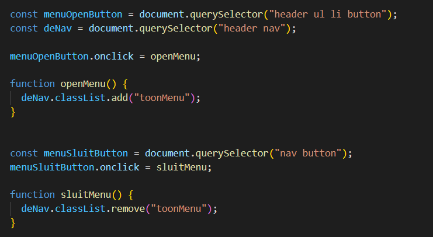
  Ik heb werkende carrousellen gemaakt, maar ik weet nog niet hoe ik ze kan laten blijven 
  werken zodra ik de scrollbalk ontzichtbaar maak. 

  Ik was ook aan het vechten met border-radius. Ik gebruikte hierbij %, omdat dit mij zo
  was aangeleerd. Het zag er dan op het ene moment normaal uit en op het andere moment 
  zag het eropeens uit zoals op de foto hieronder. 
  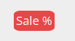
  Ik had later deze % verangen met PX en dit werkte wel goed. Ik vond dat dit wel goed 
  was om te gebruiken, omdat de border-radius hetzelfde moet blijven en niet responsive
  moet zijn. 

  ### Agenda voor meeting
  samen met je groepje opstellen

  Noah: 
  1. Hoe komt het dat mijn carousel niet werkt als ik er scrollbar-width: none; aan geef
  2. Mag ik meerdere css en javascript pagina's gebruiken?
  3. Moet ik perse javascript gebruiken bij een carrousel
  4. 

  Andere leerlingen:
  - Mijn website maakt gebruik van heeft veels div.
  - Afbeelding als link/call to action.
  - lettertypes van de website
  - in hoeverre worden animaties ook van mij verwacht (niet)
  - headings zijn plaatjes, hoe moeten dat semantische teksten   worden 
  - borders en articles zijn onduidelijk

  ### Verslag van meeting
  hier na afloop snel de uitkomsten van de meeting vastleggen

  - Gebruik geen width:100% bij het gebruiken van een flex-wrap. De content zal dan het 
  scherm vullen en niet wrappen
  - Gebruik geen flex-wrap bij een carrousel.
  - Je kan een sectie een bepaalde hoogte geven en dan plakt het daarop.
  - Je maakt plaatjes evengroot door ze dezelfde height of width te geven
  - Tekst overflow kan met text-overflow: ellipsis; white-space:nowrap; overflow: hidden;
  - maak 2 extra css pagina's aan.

## Toegankelijkheidstest 2/2 (week 4)

  
uitwerken na test in 9e werkgroep

  ### Bevindingen
  1. Ik heb geen automatisch roterende carrousellen meer. 
  2. Ik heb een licht/donker-thema toegevoegd.

## Voortgang 3 (week 4)

  
uitwerken voor 3e voortgang

  ### Stand van zaken

 Ik heb nu een groot deel van de css voor mijn eerste pagina gedaan. Het is nog niet responsive.
 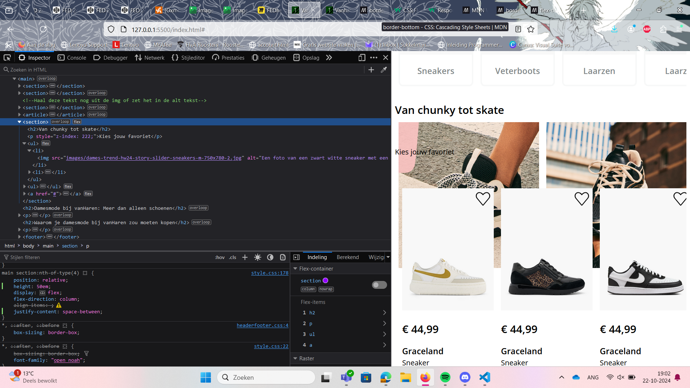
 Ik heb hiervoor grid zoveel mogelijk geprobeerd te ontwijken, omdat ik het al meerdere keren 
 heb geprobeerd toe te passen, maar het nooit echt werkte. Na het doorlezen van de css-tricks grid guide kwam ik al een stuk verder. Het klikte pas echt toen ik zag dat je een voorbeeld
 van het grid live op de pagina kan laten zien. 

Ik had moeite met deze images goed naast en onder elkaar zetten. Uiteindelijk was het er gelukkig wel van gekomen.
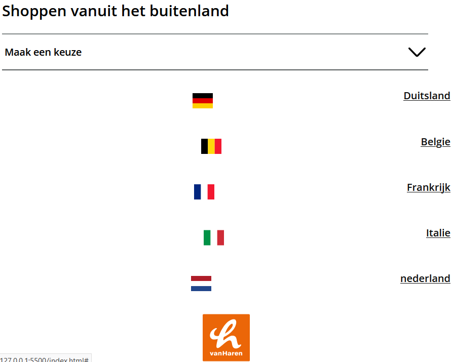

 De screenshots hieronder zijn van na deze week. 
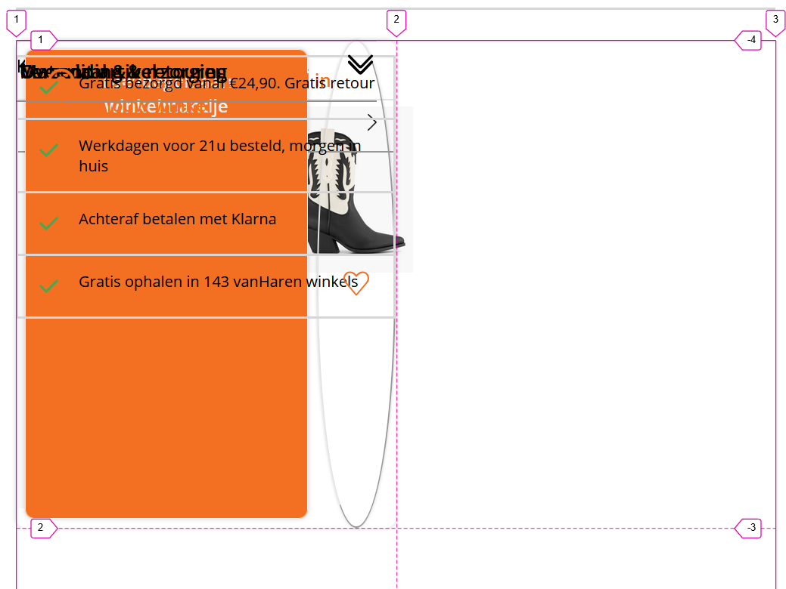

  ### Agenda voor meeting
  samen met je groepje opstellen

Noah: 
  1. Hoe zorg ik ervoor dat mijn carrousellen niet boven mijn nav uitkomen

  Andere leerlingen:
  - Hoe haal ik de radiobuttons weg en waarom doet foto het niet? 				
  - Hoe maak ik goude lijnen rondom tekst
  - Is logo animatie nodig bij het sticky menu?
  -

  ### Verslag van meeting
  hier na afloop snel de uitkomsten van de meeting vastleggen

  - Je mag meerdere nav´s hebben
  - Een link brengt je naar een andere pagina. Een button doet iets op dezelfde pagina.
  - Je moet soms specifieker zijn met hoe je content aanspreekt. 
  - gebruik z-index om de "laag" aan te geven
  - Als je een label in de li zet, dan kan je op het hele gebeuren klikken (bijvoorbeeld bij een radiobutton, dan kan je ook bijvoorbeeld op de tekst klikken of de padding er omheen)

## Eindgesprek (week 5)

  
uitwerken voor eindgesprek

  ### Je uitkomst - karakteristiek screenshots:
  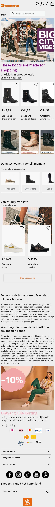

  ### Dit ging goed/Heb ik geleerd: 

  Na drie jaar snap ik eindelijk hoe grid werkt! (over het algemeen)
  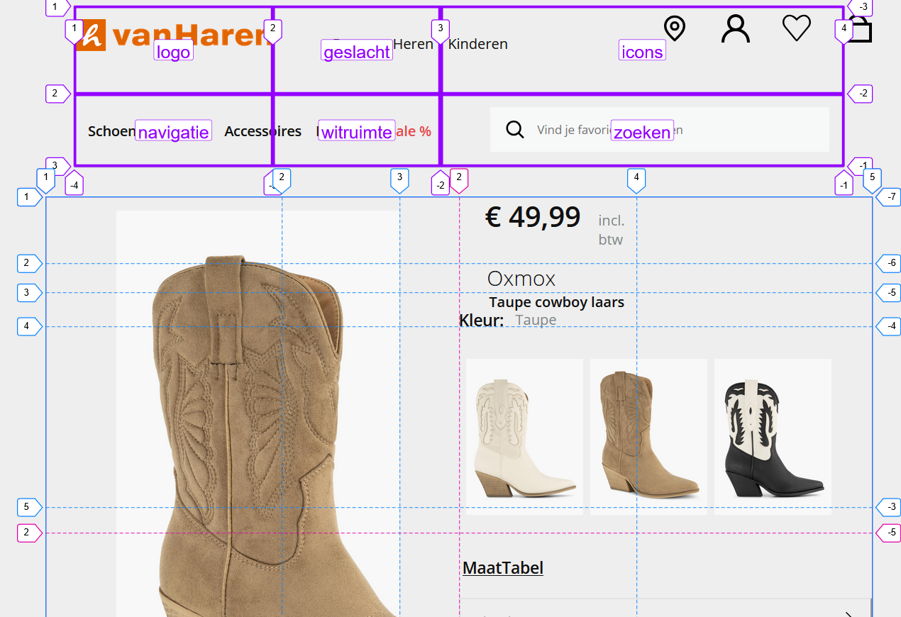
  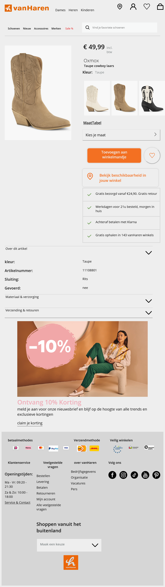

  Ik ben al super blij dat ik iets kan inleveren wat een soort van af is. Ik had niet verwacht
  dat dat mij ooit zou lukken, dus daar ben ik ook super trots op. 

  Ik heb een redelijk responsive site weten te maken. Het loopt niet super soepel, maar het 
  heeft wel duidelijk andere states bij verschillende formaten aan beeldschermen.
  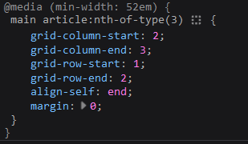

  ### Dit was lastig/Is niet gelukt:
  Mijn zelfgemaakte website haalt niet erg veel punten bij de WCAG checklist. Ik had erg veel moeite met dingen toevoegen hieruit. Ook is de website niet echt geheel professioneel ogend. 
  Het is nog teveel te zien dat het door 1 student is gemaakt die er ook niet echt heel goed in is. Ik ben blij dat ik het af heb gekregen, maar ik ben zelf ook verre van tevreden.

  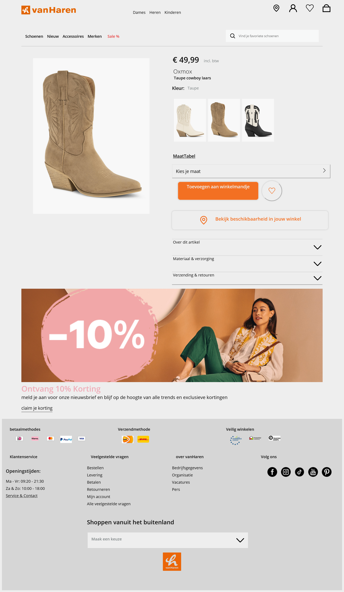

## herkansing
  De aanpassingen die ik heb gemaakt: 
  1. Ik heb de alt teksten uitgebreid
  2. Ik heb het grid aangepast en heb hier minder met rare margins gewerkt
  3. Ik heb kleine slordigheidsfoutjes eruit gehaald
  4. Ik heb de image nu achter de teksten staan en heb hier met flexbox en order gewerkt
  5. Ik heb focus states toegevoegd
  6. Ik heb mijn tweede navigatie button werkend gemaakt
  7. Ik heb ervoor gezorgd dat er op het grote scherm geklikt kan worden op de header
  8. Ik heb gewerkt met een custom property voor whitespace

## Bronnenlijst

  
continu bijhouden terwijl je werkt

  Nb. Wees specifiek ('css-tricks' als bron is bijv. niet specifiek genoeg). 
  Nb. ChatGpT en andere AI horen er ook bij.
  Nb. Vermeld de bronnen ook in je code.

  1. Wessel Daemen. Hij heeft mij geholpen met het responsive maken. We hebben er samen 
  naar gekeken en hij heeft zelf geen code verzonnen of geschreven. 
  2.  Bij het helpen van het snappen van grid. Ik heb geen code direct gekopieerd.    https://css-tricks.com/snippets/css/complete-guide-grid/
  3.  Bij het helpen van het snappen van flexbox. Ik heb geen code direct gekopieerd.     https://css-tricks.com/snippets/css/a-guide-to-flexbox/
  4. Studentassistes. Ze hebben mij geholpen met mijn navigatie en met de carrousel die over 2 plaatjes heen gaat op de index.html pagina.
  5. Codepen voor het Hamburgermenu.
  

